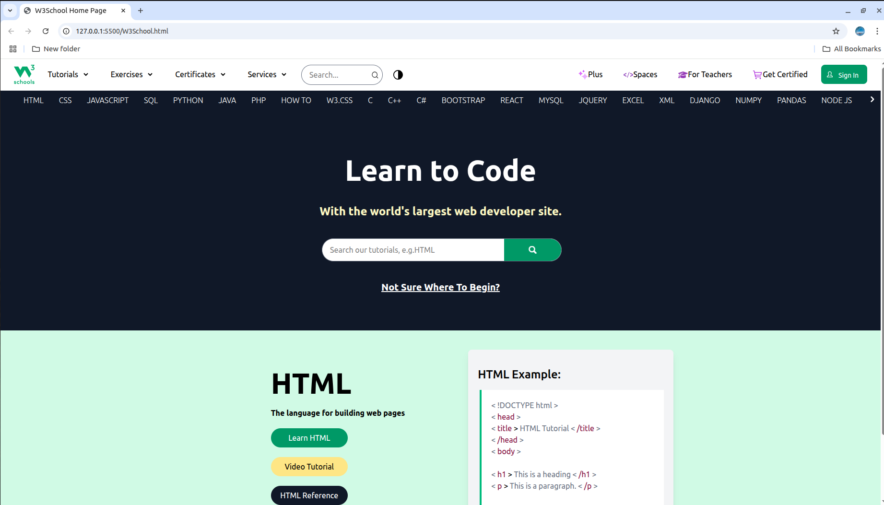

# 🌐 W3Schools Home Page Clone — HTML + Tailwind 

## 📖 Description  
A **front-end clone** of the **W3Schools home page** built with **HTML5** and **Tailwind CSS**.  

The design replicates W3Schools’ educational interface with:  
✨ A prominent search bar  
📚 Quick-access cards for different technologies (HTML, CSS, JavaScript, Python, SQL, etc.)  
🎨 Clean, professional UI 

---

## 🛠️ Tech Stack  
- ⚡ **HTML5**  
- 🎨 **Tailwind CSS**  

---

## 🚀 Features  
- 🔎 Prominent search bar for learning resources  
- 📚 Quick navigation cards for popular technologies  
- 🖼️ Hero section with responsive layout
- 🎨 Hover effects + modern typography   

---

## ⚡ How to run  
1. 📥 Clone the repo  
   ```bash
   git@github.com:varshavikraman/w3schools-Home-Page.git 
2. Open `W3School.html` in your browser

---

## 📸 Screenshot 


